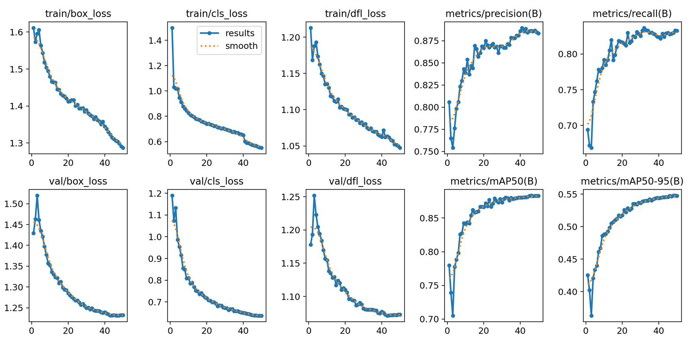
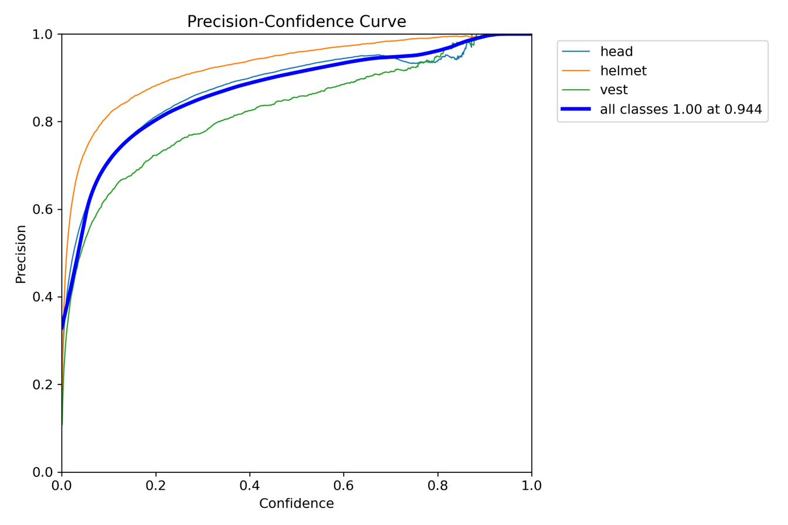
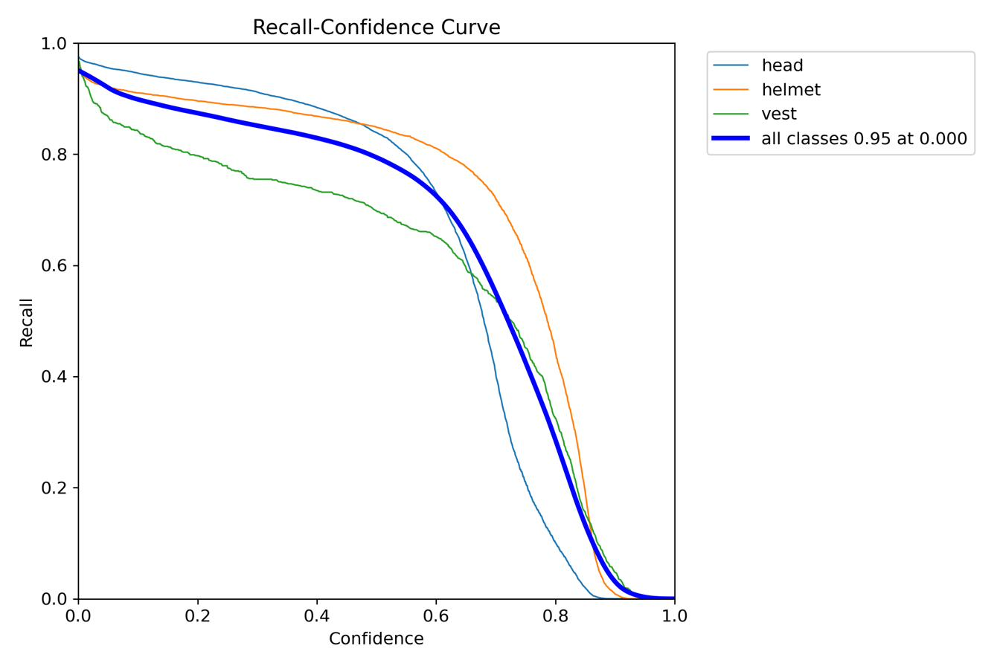
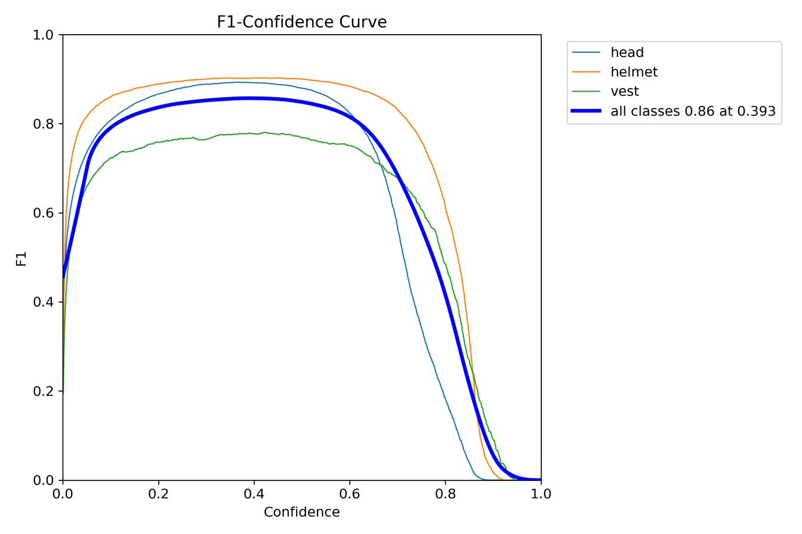

# PPE Monitoring Dashboard

A self-hosted CCTV/DVR monitoring system that runs real-time YOLO detection on
live camera feeds, video files, or RTSP streams to flag PPE violations
(missing helmet / missing safety vest), logs them with snapshots, and serves
a live multi-camera dashboard over the web.

## Features

- **Multi-source video ingestion** — USB webcams, uploaded video files, RTSP
  streams, or CCTV/DVR devices (Hikvision, Dahua, Uniview, ONVIF, Android IP
  Webcam) via guided brand presets (`cctv.py`).
- **Two detection strategies** (`config.py`, `detection.py`):
  - *Negative-label* models that name the violation directly (e.g. "No
    Helmet").
  - *Positive-label* models that only detect the gear present (head, helmet,
    vest); violations are inferred geometrically by testing overlap between
    a head/torso region and nearby gear boxes.
- **Per-camera worker threads** with persistent object tracking (ByteTrack),
  de-duplicated violation logging (per-track and per-feed cooldowns), and
  auto-cropped, captioned snapshot images.
- **Role-based web dashboard** (Flask): live MJPEG streams, playback controls
  for video files, per-feed violation logs, a searchable snapshot gallery,
  CSV export, and per-feed model switching — all gated by admin/user roles
  and per-user feed permissions.
- **Local network camera discovery** (`discover.py`) via ONVIF WS-Discovery
  and a CCTV-port sweep.

## Project layout

```
.
├── main.py            # entrypoint: CLI args, model loading, server startup
├── server.py           # Flask routes, feed registry, HTTP API
├── auth.py             # accounts, roles, per-feed permissions, sessions
├── detection.py         # YOLO tracking loop, violation detection/logging
├── db.py                # all SQLite access (violations table)
├── cctv.py              # brand-preset RTSP/HTTP URL builder + ONVIF lookup
├── discover.py           # LAN camera/DVR discovery tool (run standalone)
├── config.py             # central config: models, thresholds, keys
├── templates/
│   ├── login.html
│   ├── dashboard.html
│   └── admin.html
├── feeds.json            # persisted feed list (seeded on startup)
└── docs/                 # training result charts for the bundled model(s)
```

## Setup

```bash
pip install flask werkzeug opencv-python ultralytics torch onvif-zeep
```

Place a YOLO weights file (e.g. `best.pt` and/or `my_model.pt`, see
`config.MODELS`) next to `main.py`, then:

```bash
python main.py
```

Open the printed `http://localhost:5000` link. On first run a default admin
account (`admin` / `admin`) is created — **change this password immediately**
from the Users panel (`/admin`).

### Common run options

```bash
python main.py --model best.pt --device auto
python main.py --config feeds.json           # seed multiple feeds at startup
python main.py --source usb0                 # single default webcam feed
python main.py --host 0.0.0.0 --port 5000
```

### Finding cameras on your network

```bash
python discover.py
```

Scans for ONVIF devices and common CCTV ports (RTSP 554, Hikvision 8000,
Dahua 37777, web UIs) on your local subnet. Only scan networks you're
authorized to scan.

## Security notes

- **`.secret_key`** (Flask's session-signing key) is generated automatically
  on first run and is **excluded from this repo** via `.gitignore`. Do not
  commit it — anyone with that value can forge login sessions.
- Change the default admin password on first login.
- `violations.db`, `snapshots/`, and `uploads/` are excluded from version
  control since they contain captured footage/images of real people.
- Camera credentials entered via the dashboard are stored server-side only;
  `mask_url()` ensures raw stream URLs (with embedded passwords) are never
  sent to the browser.

## Model training results

Training/validation curves and confusion metrics for the bundled detection
model:





